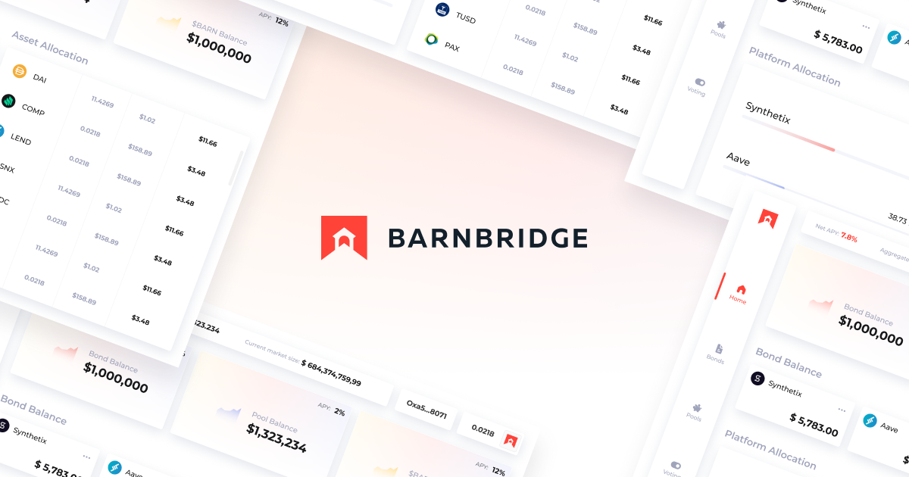

# Introduction to BarnBridge

BarnBridge is a risk tokenizing protocol. It allows hedging yield sensitivity and price volatility by accessing debt pools on other DeFi protocols, and transforming single pools into multiple assets with varying risk/return characteristics.

BarnBridge idea and whitepaper were originally conceived in Q2 2019, but started getting built a year later, in May 2020, and was officially introduced in September 2020. BarnBridge aims at facilitating the transition to a decentralized financial system addressing some key aspects of institutional activity, such as risk management and access to fixed income instruments.

The team is working to make the decentralized financial system more efficient, risk-flexible, and attractive to a wider range of participants through their fluctuation derivative protocol. BOND, the native token of BarnBridge, is an ERC-20 token that can be used to stake on the system and for governance once the governance module is launched.

