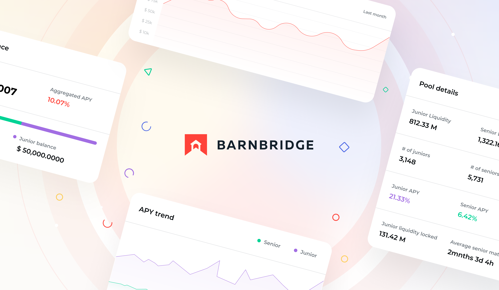

# 📌 Get Started with BarnBridge

Hey there!\
\
We are pleased to welcome you on the BarnBridge Docs page. It’s a great place to start learning more about the protocol and its products.

BarnBridge is a risk tokenizing protocol. It aims to reduce the risks associated with DeFi, such as interest rate sensitivity and market price volatility risk. By letting users select a risk profile, BarnBridge can redistribute risk via tokenized, liquid tranches. BarnBridge does this with its SMART Yield and SMART Alpha products, all of which address a specific DeFi risk category.

The continued development of the dApps is provided by the core team and governed by the community through the BarnBridge DAO.

Watch the "What is BarnBridge" video below to get a more detailed overview of the protocol:&#x20;



To learn even more, feel free to check the following materials that explicitly cover the protocol and products details:

* [BarnBridge: Risk-Adjusted Exposure to Decentralized Finance](https://docs.google.com/document/d/18nCG-\_TlT0WfPWU0sucmkM\_efuUP4dw85ZMjSdjQqEA/edit?usp=sharing)
* [Beginner’s Guide to Governance](governance/beginners-guide-to-governance.md)
* [Beginner’s Guide to SMART Yield](smart-yield/beginners-guide-to-smart-yield.md)
* [Beginner's Guide to SMART Alpha](beginners-guide-to-smart-alpha.md)

Here’s the list of additional resources you may be interested in:

* [Whitepaper](https://github.com/BarnBridge/BarnBridge-Whitepaper)
* [Medium Blog](https://medium.com/barnbridge)
* [GitHub](https://github.com/barnbridge/)

Also, feel free to jump into our social media to get engaged with the community:

* [Discord Community Server](https://discord.gg/JsAZTYmD)
* [Twitter](https://twitter.com/Barn\_Bridge)
* [YouTube](https://www.youtube.com/channel/UC4exzX\_c37p2gYJK4L9nrGQ)
* [Telegram](https://t.me/BarnBridgeChannel)

Now, let’s get started!

