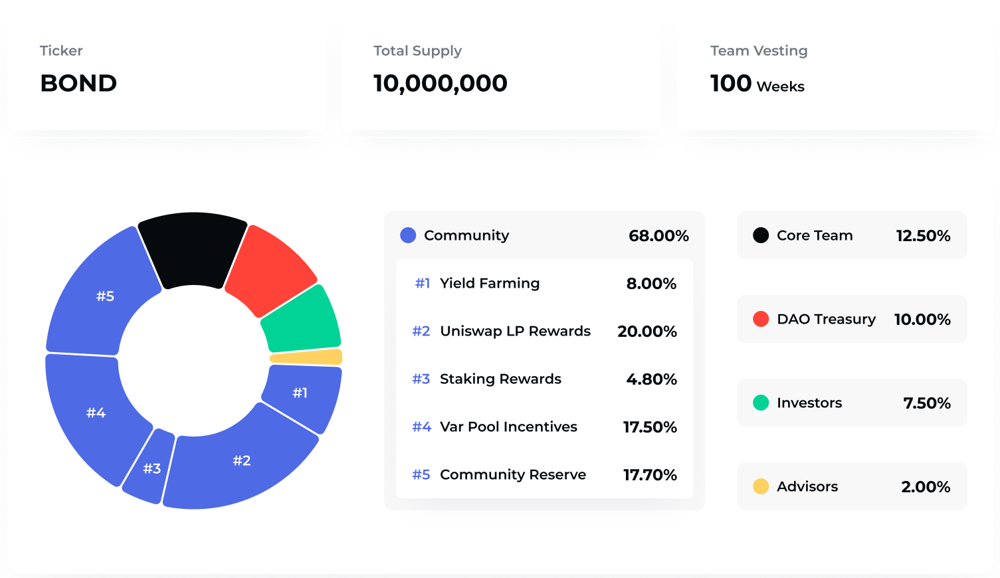

# FAQ

## General

### 1. Where to start?

BarnBridge is the first cross-platform risk tokenizing protocol. It aims to reduce risks associated with DeFi, such as inflation risk, market price and interest rate volatility risk.

📔 [Get Started with BarnBridge](https://docs.barnbridge.com/get-started-with-barnbridge)

## BOND Token

### 2. What is a BOND token?

BOND token is a governance token that powers the BarnBridge DAO protocol.

BOND is an ERC-20 token. Token holders have the ability to govern the network by staking their holdings in return for the right to participate in on-chain voting and make decisions on the protocol development.

* BOND total supply: 10,000,000 \(minting function is disabled\).
* Token contract address: [0x0391D2021f89DC339F60Fff84546EA23E337750f](https://etherscan.io/token/0x0391D2021f89DC339F60Fff84546EA23E337750f)

📔 [What can you do with your BOND?](governance/what-can-i-do-with-bond.md)

### 3. What is BOND token distribution?

The distribution breakdown is designed to facilitate the protocol decentralization and make sure the power doesn’t reside in the hands of a few. 

ℹ️ [Token distribution and liquidity schedule](https://barnbridge.com/token-bond/)

### 4. How long is the team vesting schedule?

The vesting schedule is designed so that there is not a giant cliff waiting over user’s heads at a specific point. The tokens allocated to the Founders, Seed Investors, and Advisors are locked in a smart contract that releases the tokens on a weekly basis over a two year period. The vesting period started with the launch of the Yield Farming mechanism on Oct 19th, 2020.

### 5. How many tokens are released each week?

As of right now, a total of 82,200 BOND tokens is distributed weekly:

* USDC/BOND pool: 20,000;
* DAO staking: 12,200;
* Team vesting: 22,000;
* SY junior incentivization: 28,000.

You can also check the current circulating supply in our Discord bot or using the [website](https://barnbridge.com/token-bond).

### 6. What are BOND NFT tokens?

BarnBridge Non-Fungible Tokens program was an additional initiative for rewarding active community participants with custom ERC-721 NFTs. The program ended on Jan 28th, 2021. 

Read more:  
📔[Sunsetting our NFT program with community rewards](https://medium.com/barnbridge/sunsetting-our-nft-program-with-community-rewards-85fc8fd1a82a)

### 7. How to get BOND tokens?

BOND tokens are ERC-20 compatible which means they are traded both DEXes and CEXes. The list of the available markets for BOND token purchase is available on [Coinmarketcap](https://coinmarketcap.com/currencies/barnbridge/markets/) or [CoinGecko](https://www.coingecko.com/en/coins/barnbridge#markets).  
  
The DEX market with the most liquidity is a [USDC/BOND Uniswap Pool](https://app.uniswap.org/#/swap?inputCurrency=0x0391d2021f89dc339f60fff84546ea23e337750f&outputCurrency=0xa0b86991c6218b36c1d19d4a2e9eb0ce3606eb48).

### 8. How many BOND token holders are there?

As of June 10th, 2021, there are 5,800+ wallets holding BOND tokens.

You can check the latest statistics on [Etherscan](https://etherscan.io/token/0x0391D2021f89DC339F60Fff84546EA23E337750f#balances).

## Token Distribution Programs

### 9. USDC/DAI/sUSD yield farming pool

USDC/DAI/sUSD yield farming pool was launched on Oct 19th, 2020. This staking contract was the first mechanism delivering initial BOND token distribution to the community. This contract held 8% of the total supply and was distributing tokens to community members who stake DAI, USDC, & sUSD.

Read more in the Medium article:  
📔 [Yield Farming and LP Incentivization](https://medium.com/barnbridge/yield-farming-and-lp-incentivization-25eba3f55ec4)

### 10. USDC/BOND LP pool

USDC/BOND liquidity pool incentivization program was launched on Oct 26th, 2020. The concept behind the initiative is to reward long-term liquidity providers of the Uniswap USDC/BOND pool with progressively more power over the protocol as they continue to signal their belief in the BarnBridge vision. 

To stake in the pool you need to complete 2 steps:

1. Provide liquidity in both USDC & BOND to the [Uni v2 USDC/BOND pool](https://app.uniswap.org/#/add/v2/0x0391d2021f89dc339f60fff84546ea23e337750f/0xa0b86991c6218b36c1d19d4a2e9eb0ce3606eb48) and get LP tokens.
2. Stake those LP tokens in the [BarnBridge USDC\_BOND\_UNI\_LP pool](https://app.barnbridge.com/yield-farming/unilp).

You need to know that liquidity providers are exposed to different risks so we recommend checking this Medium article before considering the move:  
📔 [Yield Farming $BOND: The Risks Involved](https://medium.com/barnbridge/yield-farming-bond-the-risks-involved-7cefdba01b17)

### 11. BOND hodl pool

BOND Hodl Pool was launched on Nov 16th, 2020. It has run for 12 epochs \(weeks\) and distributed 60,000 BOND tokens in rewards to the users. BOND Hodl Pool ended on Feb 8th, 2021. Users that haven’t claimed their rewards are still able to do that by visiting the [pool page](https://app.barnbridge.com/yield-farming/bond) in the app.

### 12. DAO staking pool

DAO Staking pool was launched on Feb 8th, 2021. It was designed as an extra incentive for the early DAO participants. In addition to voting power, users also receive rewards from the DAO rewards pool.

The pool was preloaded with 610,000 BOND tokens that should be distributed within 50 weeks.

Read more in the Medium article:  
📔 [Pool 3 ends and DAO governance rewards begins](https://medium.com/barnbridge/pool-3-ends-and-dao-governance-rewards-begins-8e57ec5041)

Learn how to stake in the DAO in this guide:  
ℹ️ [How to stake in the DAO?](governance/barnbridge-dao-faq/how-to-obtain-voting-power-on-the-dao.md)

### 13. SMART yield junior incentivization program

Junior incentivization was launched with the Compound USDC pool on March 31, 2021. It was then expanded by the DAO vote to subsidize Aave and Cream pools as well.

**Compound \(launch date: Mar 31, 2021; duration: 25 weeks\):**

* USDC: 10,000 BOND/week

**Aave \(launch date: May 30, 2021; duration: 10 weeks\):**

* USDC: 10,000 BOND/week
* USDT: 4,000 BOND/week
* DAI: 2,500 BOND/week
* GUSD: 500 BOND/week

**C.R.E.A.M. \(launch date: May 30, 2021; duration: 10 weeks\):**

* USDC: 500 BOND/week
* USDT: 250 BOND/week
* DAI: 250 BOND/week

To start using the pools, you need to mint junior tokens and stake in the junior yield farming pool.  
➡️ [Use app](https://app.barnbridge.com/smart-yield/markets)

### 14. What is the APR?

You can check the APR for all the pools on [CoinGecko](https://www.coingecko.com/en/yield-farming).

## BarnBridge Governance

### 15. What is Launch DAO \(Closed\)?

BarnBridge has been using the “DAO First” governance model, which means it has never been, and never will be, a traditional company. Instead, BarnBridge founders decided to launch the project as a DAO and split the governance between the core team. This DAO was called LaunchDAO.

It was created using Aragon DAO Company Template which uses transferable tokens to represent ownership stake. Decisions are made based on stake-weighted voting with the BBVOTE token. 

The Founders received 45%, Seeders received 45%, and Advisors got 10%. The minimum voting support is set to 62%, meaning for a proposal to be passed it must be approved by at least 62%.

The funds from the seeders and the initial supply of the BOND token will be kept in the Launch DAO treasury. You can find the LaunchDAO [here](https://client.aragon.org/#/barnbridgelaunch/).

LaunchDAO is now closed. BarnBridge protocol is completely governed by the community through the Barnbridge DAO.

🔗 [Website page](https://barnbridge.com/launch-dao)

### 16. What is BarnBridge DAO and how BarnBridge governance works?

BarnBridge governance is structured around the BarnBridge DAO which is controlled by the BOND token holders. It has full control over the protocol and the features that are built into it. 

Learn more by checking resources below:  
📔 [Beginner’s Guide to BarnBridge Governance](governance/beginners-guide-to-governance.md)  
📔 [DAO Specifications](https://integrations.barnbridge.com/specs/dao-specifications)

### 17. What is Signal \(Snapshot page\)?

Snapshot.page is an off-chain gasless governance client. We use it to test the proposal potential before we create a real one on the Ethereum mainnet. Creating a proposal and voting is free, no transactions needed. Proposals and votes are just signed messages stored on IPFS. Signatures are easily verifiable online, they use the "eth\_sign" format.

🔗 [BarnBridge Signal](https://signal.barnbridge.com/)

### 18. How to lock tokens in the DAO?

Users are able to lock BOND tokens in the DAO to increase their voting power. However, locking does NOT increase the pool share and, therefore, the amount of rewards in the DAO staking pool.

Learn more about locking tokens:  
📔 [How does locking BOND tokens work?](https://integrations.barnbridge.com/specs/dao-specifications#users-can-lock-bond-for-vbond)  
ℹ️ [How to lock tokens in the DAO?](governance/barnbridge-dao-faq/how-to-lock-bond-to-increase-voting-power.md)

### 19. How to delegate voting power?

Delegating voting power can be used by anyone who stakes BOND tokens in the DAO. 

Learn more about voting power delegation:  
📔 [How does it work?](https://integrations.barnbridge.com/specs/dao-specifications#users-can-delegate-vbond-to-other-users)  
ℹ️ [How to delegate voting power?](governance/barnbridge-dao-faq/how-to-delegate-voting-power.md)

### 20. How to withdraw BOND from the DAO?

BOND tokens can be withdrawn from the DAO at any time unless they are locked.

Here’s the guide on how to do it:  
ℹ️ [How to withdraw BOND from the DAO?](governance/barnbridge-dao-faq/how-to-withdraw-bond-from-the-dao.md)

## SMART Yield

### 21. What is SMART Yield?

SMART Yield pools the yield from the lending platforms, such as Aave and Compound, and splits it into tranches with different risk profiles.

Tranches are represented by junior \(ERC-20\) and senior \(ERC-721\) tokens. Junior token holders provide liquidity & buy risk from senior bond investors. The risk here is variable rate annuities going below the expected level. Investors that buy senior bonds will have a guaranteed yield/interest rate for the life of the bond.

At the same time, juniors will benefit from the extra rewards generated by tokens locked by seniors in cases where the variable APY of the underlying lending protocol \(including the governance token rewards\) are higher than the weighted average guaranteed yields of current seniors.

Learn more about SMART Yield:  
📔 [Beginner's Guide to SMART Yield](smart-yield/beginners-guide-to-smart-yield.md)  
🔗 [Website](https://barnbridge.com/smart-yield)

### 22. What are tranches?

Tranches are pieces of a pooled yield that are split up by risk in order to be marketable to different investors.  
  
In BarnBridge ecosystem tranches are represented by ERC-20 and ERC-721 tokens. 

To learn more about tranching risk in SMART Yield, check this guide:  
📔 [Beginner's Guide to SMART Yield](smart-yield/beginners-guide-to-smart-yield.md)

### 23. What are the junior and senior APYs?

Junior and senior APYs are determined based on the average originator APY for the past 3 days. This mechanism enables an additional layer of protection against unexpected volatility on the originator side.

Junior APY determines the annual percentage yield for junior tokens at the current time. The APY for your junior position is realized when selling junior tokens for their respective underlying tokens, at whatever the current junior token-to-underlying token price is.

Senior APY determines the annual percentage for senior bonds at the current time. It can be derived for any and all senior bonds in existence by annualizing the percentage difference between the deposited value and the gained value using the following formula:

`((gain/principal) / (maturesAt - issuedAt)) * 365 * 100`

### 24. What are the SMART Yield fees?

On the junior side, fees are collected on jToken purchases. On the senior side, fees are collected after maturity date, and only from the gaing of the bond when sBond is redeemed.

* Junior fee: 0.5% on deposit
* Senior fee: 5% on gains

### 25. How to deposit into SMART Yield?

In order to buy junior tokens or purchase senior bonds, you have to connect your wallet at [https://app.barnbridge.com](https://app.barnbridge.com) and follow the instructions described in the guides below.

ℹ️ [How to buy junior tokens?](smart-yield/smart-yield-faq/how-to-buy-junior-tokens.md)  
ℹ️ [How to purchase senior bonds?](smart-yield/smart-yield-faq/how-to-buy-senior-bonds.md)

### 26. How to redeem senior bonds?

To redeem senior bonds you have to wait until the maturity date of the bond.

ℹ️ [How to redeem senior bonds?](smart-yield/smart-yield-faq/how-to-redeem-senior-bonds.md)

### 27. How to withdraw junior tokens?

If you want to get your liquidity and profits you can withdraw it from the pool. To do so, you have 2 options:

**1. Instant Withdrawal**

Instant withdrawal allows you to get access to your liquidity immediately but requires to forfeit a specific amount of the capital. That amount is determined at the moment of withdrawal and depends on the amount of senior gains in the pool that have to be covered by pooled junior deposits.

**2. 2-step Withdrawal**

2-step withdrawal allows the withdrawal of the full amount of liquidity but in the future. 

The first step is issuing a junior bond with parameters including the withdrawal amount and a maturity date \(which is calculated at the time of the bond minting and depends on the avg. senior maturity\).

The second step is redeeming the junior bond at maturity. 

ℹ️ [How to withdraw junior tokens?](smart-yield/smart-yield-faq/how-to-withdraw-junior-tokens.md)

### 28. How to stake jTokens for BOND rewards?

The junior incentivisation pool is a great opportunity for gaining some extra rewards. To stake jTokens you need to use a SMART Yield product on the junior side. 

ℹ️ [How to stake jTokens for BOND rewards?](smart-yield/smart-yield-faq/how-to-stake-jtokens-and-earn-bond-rewards.md)

### 29. What is Pavlos loop?

SMART Yield is aligning two different groups of DeFi market participants to create a TVL-accruing flywheel.  As more participants enter into junior tranches, the fixed income rate offered by the next marginal senior tranche rises until one market participant purchases that tranche, thereby providing more capital to the protocol and driving up the variable rate being earned by all junior tranches. This cycle is best captured by “Pavlo’s Loop” as described in the community Discord chat: 

`more juniors = more seniors = more juniors = more seniors = ...`  

