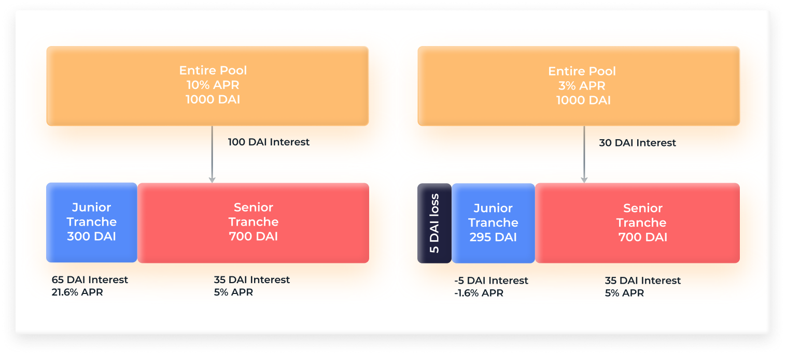
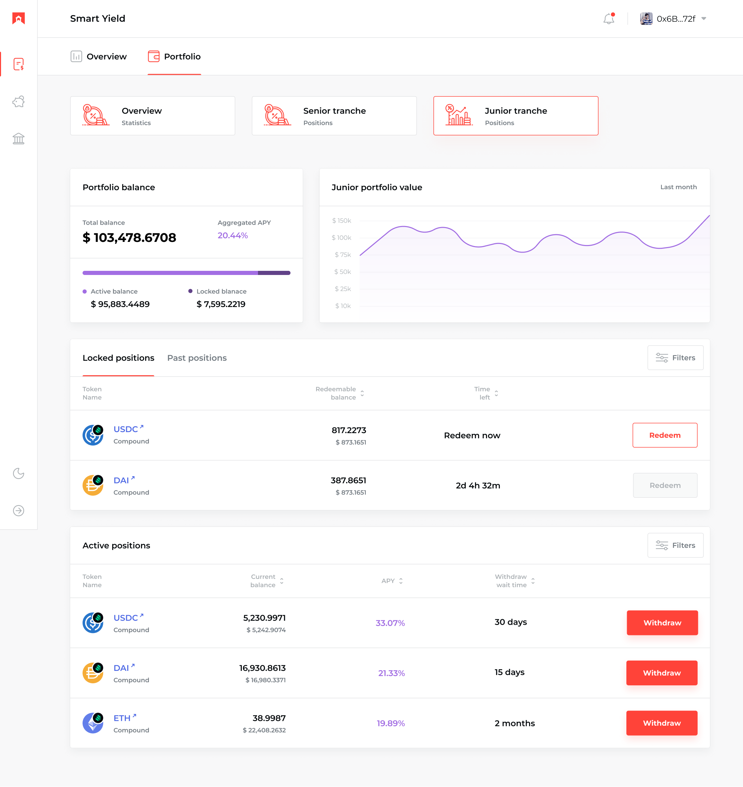
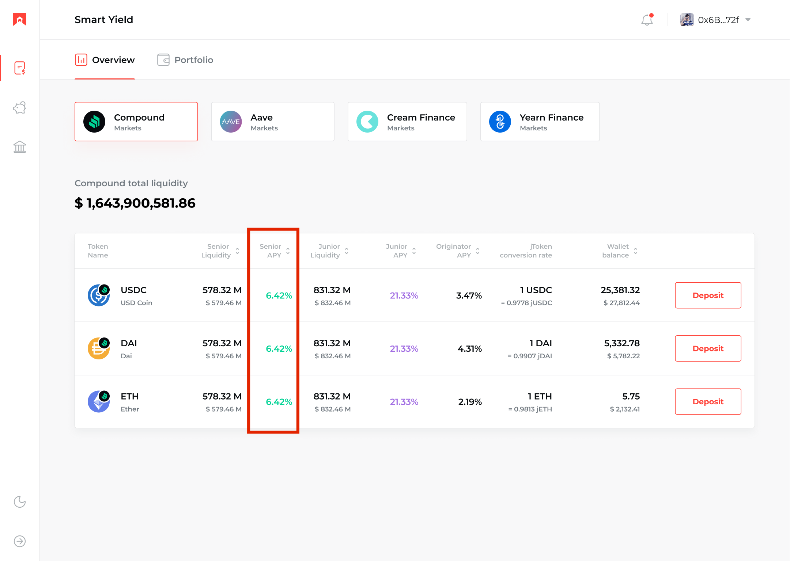
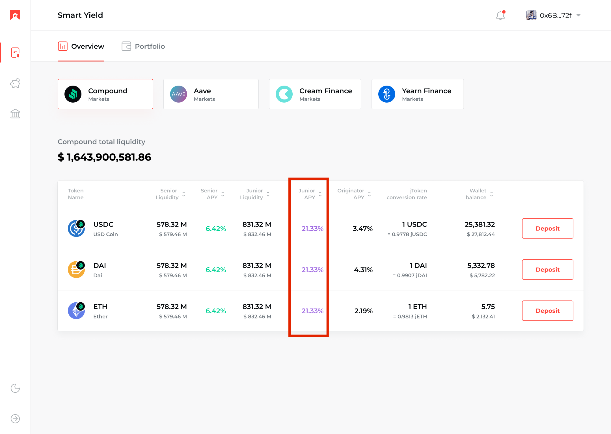

# FAQ

## General

### Where to start?

BarnBridge is the first risk tokenizing protocol. It allows hedging yield sensitivity and price volatility.  BarnBridge does this by accessing debt pools on other DeFi protocols and transforming single pools into multiple assets with varying risk/return characteristics.

If you want to learn more about the project you should start by reading our [Introducing BarnBridge](https://medium.com/barnbridge/introducing-barnbridge-3f0015fef3bb) article on our [blog](https://barnbridge.com/). For a better understanding of the idea behind BarnBbridge take a look at our [Whitepaper](https://github.com/BarnBridge/BarnBridge-Whitepaper). In addition, you can view all our contributors on the [team page](http://barnbridge.io/team). 

Follow us on [Twitter](https://twitter.com/barn_bridge), [Medium](https://medium.com/barnbridge) and sign up for the [newsletter](https://barnbridge.com/) to always get the latest updates.

### What is the purpose of the project?

We started BarnBridge because we want to use it. 

BarnBridge seeks to provide a range of products that allows investors of all skill levels to manage their individual and portfolio risk exposure through a secure, decentralized, and permissionless platform. 

At scale, BarnBridge allows you to trade in and out of any risk exposed position for any asset in the world.  Assuming infinite liquidity, we can build infinite numbers of products and hedged strategies.

### **Is there a Telegram group?**

We do have a Telegram group but we’re currently building community on [Discord](https://discord.gg/FfEhsVk)**.**

Attention! The only official BarnBridge Telegram group is [https://t.me/barnbridge\_official](https://t.me/barnbridge_official). Other groups or bots are scams. Please, report as you see them.

### **Are you considering L2 as a possible solution for improving gas fee efficiency?**

Yes, we’re definitely looking at L2 solutions and their adoption across other protocols. Check some of our previous answers on Discord: [here](https://discord.com/channels/748538797662273636/751179180053364830/801127333746049095) and [here](https://discord.com/channels/748538797662273636/751179159077650549/788041682590367745%20).

What is the $BOND token?

The $BOND token is a governance token that powers the BarnBridge DAO protocol.  
$BOND is an ERC-20 token. Holders of the token will have the ability to govern the network by staking their holdings in return for the right to govern the network.  
  
The $BOND token is tradeable on any exchange and storable on any wallet that has adopted the ERC-20 token standard - providing broad access across the world.

## What is $BOND token total supply?

The total amount of $BOND tokens is fixed at 10,000,000. There is no ability to create or issue additional tokens.

### What is the $BOND token contract address?

[0x0391D2021f89DC339F60Fff84546EA23E337750f](https://etherscan.io/token/0x0391D2021f89DC339F60Fff84546EA23E337750f)

### What is the token distribution?

The distribution breakdown is designed to facilitate the most decentralized protocol and make sure power doesn’t reside in the hands of a few. 


### How long is the vesting schedule?

The vesting schedule is designed so that there is not a giant cliff waiting over user’s heads at a specific point. The tokens allocated to the Founders, Seed Investors, and Advisors are locked in a smart contract that releases the tokens on a weekly basis over a two year period. The vesting period started with the launch of the Yield Farming mechanism.  
  
[Learn More](https://github.com/BarnBridge/BarnBridge-Whitepaper#311-fair-vesting).

### How many tokens are released each week?

As of right now, a total of 79,000 %BOND tokens is distributed weekly.

* USDC/DAI/sUSD Pool: 32,000;
* USDC/BOND Pool: 20,000;
* $BOND \#Hodl Pool: 5,000;
* Team vesting: 22,000.

### What are $BOND NFT tokens?

BarnBridge Non-Fungible Tokens program was an additional initiative for rewarding active community participants with custom ERC-721 NFTs. The program has ended on Jan 28th, 2021. Read more in this [Medium post](https://medium.com/barnbridge/sunsetting-our-nft-program-with-community-rewards-85fc8fd1a82a), also taking the ticker for $BOND, were just another way of incentivizing early project supporters may be and will likely be completely pointless outside of being cool and fun. Every $BOND NFT is one of a kind. There may be similar ones in the collection but no 2 are exactly the same.  
  
Downstream, we’ve seen DeFi projects propose using NFTs as proof of liquidity in income streams & wrapped NFTs as loan representations. With almost every high profile DeFi project experimenting in one way or another, the point is clear: DeFi is looking into NFTs. While we’ve been looking at what NFTs mean for DeFi, at the moment, we’re just paying attention.  
  
Learn more in our [Medium article.](https://medium.com/barnbridge/introducing-the-barnbridge-erc-721-the-nft-bond-collection-ca2be6aefa84)

## DAO Governance

### What is LaunchDAO?

BarnBridge has been using the “DAO First” governance model, which means it has never been, and never will be, a traditional company. Instead, BarnBridge founders decided to launch the project as a DAO and split the governance between the core team. This DAO was called LaunchDAO.

 It was created using Aragon DAO Company Template which uses transferable tokens to represent ownership stake. Decisions are made based on stake-weighted voting with the $BBVOTE token. 

The Founders received 45%, Seeders received 45%, and Advisors got 10%. The minimum voting support is set to 62%, meaning for a proposal to be passed it must be approved by at least 62%.  
The funds from the seeders and the initial supply of the $BOND token will be kept in the Launch DAO treasury. You can find the LaunchDAO [here](https://client.aragon.org/#/barnbridgelaunch/).

### What is BarnBridge DAO?

BarnBridge DAO is the DAO that is controlled by the $BOND community. The BarnBridgeDAO has full control over the protocol and the features that are built into it. It is the final protocol DAO.  
BarnBridge DAO specifications are fully covered by this Medium post: [BarnBridge DAO: Built for the Future](https://medium.com/barnbridge/barnbridge-dao-built-for-the-future-3735fbd671c5).

### What is the difference between LaunchDAO and BarnBridge DAO?

LaunchDAO was a temporary DAO that consisted of the project founders, seeders and advisors for building the initial version of the protocol. LaunchDAO used $BBVOTE token.

BarnBridge DAO is the final DAO where the community can vote with their $BOND tokens. The BarnBridge DAO is the core component of the BarnBridge platform as it enables decentralized decision making to enforce actions in the interest of the community.   
Find more details about our “DAO First” approach in this Medium post: [DAO First: A new governance model](https://medium.com/barnbridge/dao-first-a-new-governance-model-863e8434bf00).

## Token Distribution Programs

### **USDC/DAI/sUSD Yield Farming Pool**

USDC/DAI/sUSD yield farming pool was launched on Oct 19th, 2020. This staking contract was the first mechanism delivering initial $BOND token distribution to the community. This contract holds 8% of the total supply and will be distributed to community members who stake DAI, USDC, & sUSD.

Stablecoins are equally rewarded. 1 USDC = 1 DAI = 1 sUSD.  
Read more about the pool in this Medium post: [Yield Farming and LP Incentivization](https://medium.com/barnbridge/yield-farming-and-lp-incentivization-25eba3f55ec4).


### **USDC/BOND LP Pool**

USDC/BOND liquidity pool incentivization program was launched on Oct 26th, 2020. The concept behind the initiative is to reward long-term liquidity providers of the Uniswap USDC/BOND pool with progressively more power over the protocol as they continue to signal their belief in the BarnBridge vision.  
  
You have to stake the uniswapv2 LP tokens \(USDC\_BOND\_UNI\_LP\). You’ll get them for providing liquidity to the [USDC/BOND pool](https://app.uniswap.org/#/add/0x0391d2021f89dc339f60fff84546ea23e337750f/0xa0b86991c6218b36c1d19d4a2e9eb0ce3606eb48) on Uniswap.

Read more about USDC/BOND pool on Medium: [Yield Farming and LP Incentivization](https://medium.com/barnbridge/yield-farming-and-lp-incentivization-25eba3f55ec4) and [Yield Farming $BOND: The Risks Involved](https://medium.com/barnbridge/yield-farming-bond-the-risks-involved-7cefdba01b17).


### **How can I earn rewards from the USDC/BOND pool?**

1. Go to the Uniswap BOND/USDC pool and start providing liquidity [here](https://app.uniswap.org/#/add/0x0391d2021f89dc339f60fff84546ea23e337750f/0xa0b86991c6218b36c1d19d4a2e9eb0ce3606eb48).  
2. Get LP tokens.  
3. Stake LP tokens on BarnBridge platform [here](https://app.barnbridge.com).

### **$BOND Hodl Pool**

$BOND Hodl Pool was launched on Nov 16th, 2020. It has been running for 12 epochs \(weeks\) and distributing 60,000 $BOND tokens in rewards to the users. 

 Read more information on Medium: [Introducing BarnBridge Pool \#Hodl](https://medium.com/barnbridge/introducing-barnbridge-pool-hodl-b07f206e9c6a).

### DAO Staking Pool

DAO Staking pool will be launched on Feb 8th, 2021. It will distribute rewards to the users who stake $BOND on the BarnBridge DAO. More details to be revealed soon.

### **What if I deposit after the start of the epoch?**

The deposit works like this: for the current epoch, the amount that is taken into consideration when the reward is calculated is relative to the time when you deposited. 

If you enter when there’s only 20% time left, your effective balance will be equal to actual balance \* 20% where the multiplier is exactly that 20%. For the next epoch \(and any subsequent epoch\), the multiplier is set back to 100%. 

If you deposit some more, the multiplier will be less, but the effective balance will always be greater than the previous. For example: you start the epoch with 100 DAI, then deposit 100 DAI at exactly 50% of the epoch =&gt; your effective balance for this epoch is 150 DAI = 100 + 50% \* 100 or 200\*75% - 75% being the new weighted-average multiplier.


This mechanic works for the USDC/DAI/sUSD Pool 1 and USDC/BOND Pool 2 but not for the DAO Staking Pool where you get rewards for the time you staked in the pool.


### What if I withdraw before the end of the epoch?

If you withdraw before the epoch ends, there are 2 possibilities: 

You withdraw the full amount =&gt; in which case your effective balance goes to 0 because your actual balance, which is now 0, multiplied by any kind of multiplier is still 0.

You withdraw only a part of it =&gt; the multiplier is recalculated as the weighted average of the deposits \(let’s say you deposit 100 DAI then after half of the time you withdraw 50 DAI =&gt; you’ll end up just like you initially deposited 50 DAI\). 

Any withdrawal causes the reward for the amount of money withdrawn to be lost.


This mechanic works for the USDC/DAI/sUSD Pool 1 and USDC/BOND Pool 2 but not for the DAO Staking Pool where you get rewards for the time you staked in the pool.


### What is the current APY?

You can check the APY for all pools on [CoinGecko](https://www.coingecko.com/en/yield-farming).

## SMART Yield

### What is SMART Yield?

SMART Yield allows users to tranche out the yield from the debt pools of other projects, such as Aave, Compound, Cream, or Yearn Finance to normalize the risk curve by creating derivatives for risk mitigation.

Users are able to buy junior or senior tokens which represent tranches. Junior token holders provide liquidity & buy risk from senior bond investors. The risk here is variable rate annuities going below the expected level. Investors that buy senior bonds will have a guaranteed yield/interest rate for the life of the bond.

At the same time, juniors will benefit from the extra rewards generated by tokens locked by seniors in cases where the variable APY of the underlying lending protocol \(including the governance token rewards\) are higher than the weighted average guaranteed yields of current seniors.

 Junior tranches are ERC-20 fungible tokens. Senior tranches are ERC-721 \(NFTs\) non-fungible tokens.

 Read more on our [website](https://barnbridge.com).



### **What is a tranche?**

Tranches are pieces of a pooled collection of securities, usually debt instruments, that are split up by risk or other characteristics in order to be marketable to different investors. 

Tranches carry different maturities, yields, and degrees of risk - and privileges in repayment in case of default.

### What is a junior tranche \(token\)?

Junior tranches are represented by ERC-20 tokens \(jTokens\) which provide liquidity and buy risk from Senior bond investors. Junior tranches have variable APY and are more risky than senior tranches.

Read more about [tranches here.]()



### What is a senior tranche \(bond\)?

Senior tranches are represented by ERC-721 non-fungible tokens \(sBONDs\) that have a guaranteed yield for the life of the bond. Senior tranches have fixed APY and are less risky compared to junior tranches. 

The set of features that a senior bond has is:

* principal - the amount deposited in the bond
* gain - the amount of token that will be gained \(this is used to determine the APY\)
* issuedAt - the issuance date
* maturesAt - the maturity date
* liquidated - a flag used to determine if the senior bond was redeemed or not

Read more about[ tranches here.]()


### **What is a junior bond?**

The Junior Bonds are represented by ERC-721 non-fungible tokens that have a value denominated in junior tokens, and a maturity date equal to that of the ABOND. These special types of bonds are issued as part of the 2-step withdrawal process.

A junior is subject to Senior tranche risk. In order for a jToken holder to exit the pool, the current sBONDs need to mature. Because it is computationally intensive and gas inefficient to track each and every sBOND with each tx, we opt to use the Aggregated Bond \(ABOND\) as an approximation for the Senior tranche.

### Steps for exit: 

#### **1st step:**

* recalculate price
* transfer Junior jTokenDAI \(for example\) to pool \(lock\)
* mint a junior BOND token \(NFT\) and transfer to Junior
* queue liquidation after ABOND.maturesAt. First tx after that timestamp will trigger the liquidation.

#### **2nd step \(after the lock period has ended, the Junior can redeem the jBOND NFT and finish the Withdraw process\):**

* send junior's liquidated DAI
* burn the jBOND NFT

The set of features that a senior bond has is:

* tokens - the amount of jTokens deposited in the bond
* maturesAt - the maturity date at which it can be redeemed

### What is the ABOND?

In order to provide the best UX for Juniors and encourage them to participate in our SMART Yield pools, we want the system to allow them to join the pool at any time. Moreover we want the possibility of instant withdrawal of at least part of their funds, without affecting the integrity of the system and keeping the guarantees.

To do that, we have to be able to calculate the profits and losses of the pool very efficiently. We do that by averaging all existing senior bonds into one "weighted average" ABOND with the following properties:

* Principal locked \(sum\) -&gt; ABOND.principal
* Guaranteed rewards \(sum\) -&gt; ABOND.gain
* Start timestamp -&gt; ABOND.issuedAt
* Weighted average end timestamp -&gt; ABOND.maturesAt

The aggregate sBOND \(ABOND\) represents the current Senior pool and it will help us calculate the health of the Senior pool at an instant. If the rewards generated by the Senior pool so far exceed the guaranteed rewards at this time \(abond.paid\), the extra reward can be considered profit for the junior pool \(and loss if it's negative\).

ABOND parameters are recalculated each time new Senior bonds are purchased.

### What is the senior tranche APY?

Senior APY determines the annual percentage for senior bonds at the current time. 

It can be derived for any and all senior bonds in existence by annualizing the percentage difference between the deposited value and the gained value using the following formula:

```text
((gain/principal) / (maturesAt - issuedAt)) * 365 * 100
```

View the current senior APY here: [app.barnbridge.com/smart-yield](https://app.barnbridge.com/yield-farming).



### What is the junior tranche APY?

Junior APY determines the annual percentage yield for junior tokens at the current time. 

The APY for your junior position is realized when selling your junior tokens for their respective underlying tokens, at whatever the current junior token-to-underlying token price is. The conversion rate of junior tokens starts at 1:1, and slowly grows \(or drops\) when interest accrues. Depending on the annualized difference between your purchase and sell price you can calculate your APY.

Whenever senior positions have to be filled by junior funds \(in the case that the underlying lending protocol offers lower rates than current seniors get\), the price drops.

Otherwise, whenever yield accrues to junior positions that leverage senior funds, the conversion rate increases.

View the current junior APY here: [app.barnbridge.com/smart-yield](https://app.barnbridge.com/yield-farming).



### What are the junior tranche fees?

On the junior side, fees are collected on jToken purchases. Current junior tranche fee is set to 0.3% and can be adjusted by the BarnBridge DAO.

### What are the senior tranche fees?

On the senior side, fees are collected after maturity date, and only from the gains of the bond - when sBonds are redeemed.

Current senior tranche fee is set to 10% and can be adjusted by the BarnBridge DAO.

## SMART Alpha

### **What is SMART Alpha Bond?**

Market Price Exposure Risk Mitigation using tranched volatility derivatives.

The SMART Alpha bonds will not be structured via traditional yield tranches but instead with various levels of market price exposure, which we will call risk ramps. The idea is that every bucket or tranche of price exposure does not need to be flat across the entire risk curve, meaning the first $100 of price exposure does not need to deserve the same upside and downside volatility. This is similar to having fractional ownership but with different risk/reward for the fractions.

Read more in our [Whitepaper](https://github.com/BarnBridge/BarnBridge-Whitepaper#21-smart-yield-bonds) and on the [website](https://barnbridge.com/).

### 

