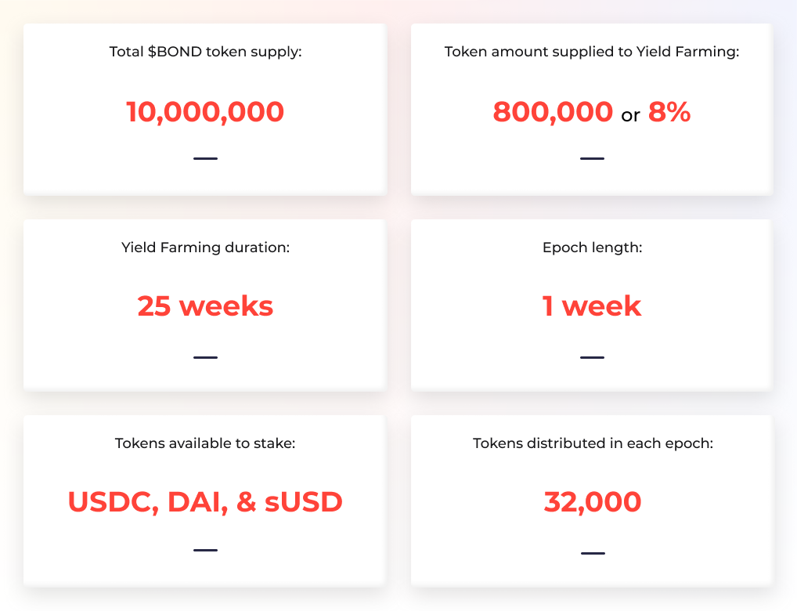
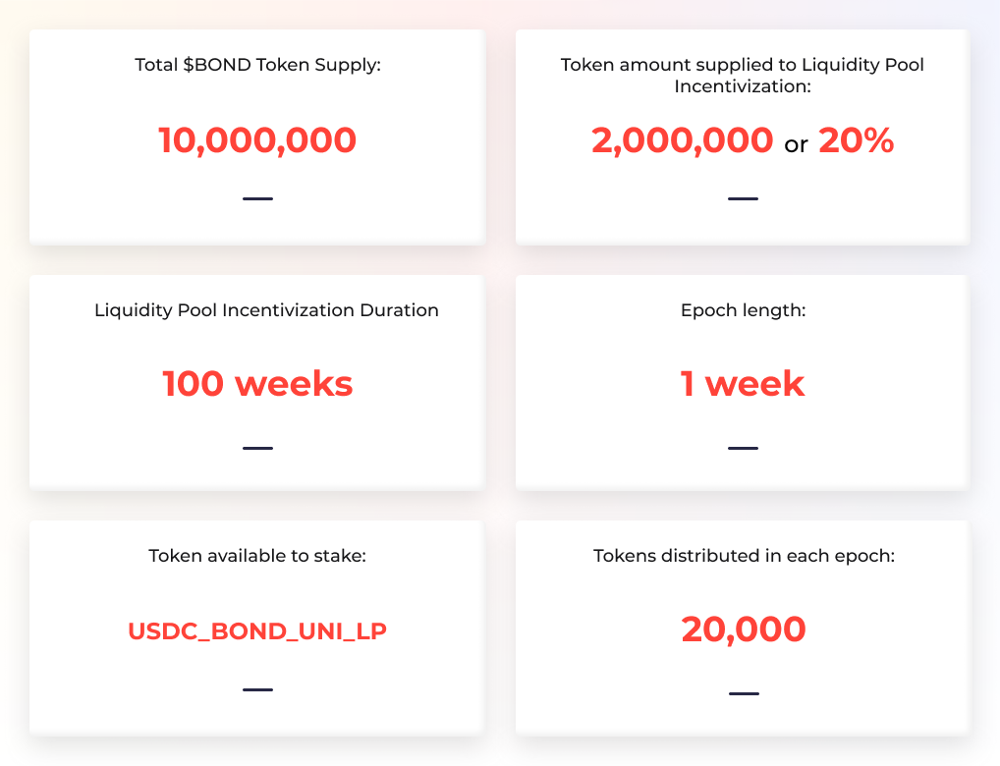

# Token Distribution Programs

## **USDC/DAI/sUSD Yield Farming Pool**

USDC/DAI/sUSD yield farming pool was launched on Oct 19th, 2020. This staking contract was the first mechanism delivering initial $BOND token distribution to the community. This contract holds 8% of the total supply and will be distributed to community members who stake DAI, USDC, & sUSD.

Stablecoins are equally rewarded. 1 USDC = 1 DAI = 1 sUSD.  
Read more about the pool in this Medium post: [Yield Farming and LP Incentivization](https://medium.com/barnbridge/yield-farming-and-lp-incentivization-25eba3f55ec4).

## **USDC/BOND LP Pool**

USDC/BOND liquidity pool incentivization program was launched on Oct 26th, 2020. The concept behind the initiative is to reward long-term liquidity providers of the Uniswap USDC/BOND pool with progressively more power over the protocol as they continue to signal their belief in the BarnBridge vision.  
  
You have to stake the uniswapv2 LP tokens \(USDC\_BOND\_UNI\_LP\). You’ll get them for providing liquidity to the [USDC/BOND pool](https://app.uniswap.org/#/add/0x0391d2021f89dc339f60fff84546ea23e337750f/0xa0b86991c6218b36c1d19d4a2e9eb0ce3606eb48) on Uniswap.

Read more about USDC/BOND pool on Medium: [Yield Farming and LP Incentivization](https://medium.com/barnbridge/yield-farming-and-lp-incentivization-25eba3f55ec4) and [Yield Farming $BOND: The Risks Involved](https://medium.com/barnbridge/yield-farming-bond-the-risks-involved-7cefdba01b17).

## **How can I earn rewards from the USDC/BOND pool?**

1. Go to the Uniswap BOND/USDC pool and start providing liquidity [here](https://app.uniswap.org/#/add/0x0391d2021f89dc339f60fff84546ea23e337750f/0xa0b86991c6218b36c1d19d4a2e9eb0ce3606eb48).  
2. Get LP tokens.  
3. Stake LP tokens on BarnBridge platform [here](https://app.barnbridge.com).

## **$BOND Hodl Pool**

$BOND Hodl Pool was launched on Nov 16th, 2020. It has been running for 12 epochs \(weeks\) and distributing 60,000 $BOND tokens in rewards to the users. 

 Read more information on Medium: [Introducing BarnBridge Pool \#Hodl](https://medium.com/barnbridge/introducing-barnbridge-pool-hodl-b07f206e9c6a).

## DAO Staking Pool

DAO Staking pool will be launched on Feb 8th, 2021. It will distribute rewards to the users who stake $BOND on the BarnBridge DAO. More details to be revealed soon.

## **What if I deposit after the start of the epoch?**

The deposit works like this: for the current epoch, the amount that is taken into consideration when the reward is calculated is relative to the time when you deposited. 

If you enter when there’s only 20% time left, your effective balance will be equal to actual balance \* 20% where the multiplier is exactly that 20%. For the next epoch \(and any subsequent epoch\), the multiplier is set back to 100%. 

If you deposit some more, the multiplier will be less, but the effective balance will always be greater than the previous. For example: you start the epoch with 100 DAI, then deposit 100 DAI at exactly 50% of the epoch =&gt; your effective balance for this epoch is 150 DAI = 100 + 50% \* 100 or 200\*75% - 75% being the new weighted-average multiplier.


This mechanic works for the USDC/DAI/sUSD Pool 1 and USDC/BOND Pool 2 but not for the DAO Staking Pool where you get rewards for the time you staked in the pool.


## What if I withdraw before the end of the epoch?

If you withdraw before the epoch ends, there are 2 possibilities: 

You withdraw the full amount =&gt; in which case your effective balance goes to 0 because your actual balance, which is now 0, multiplied by any kind of multiplier is still 0.

You withdraw only a part of it =&gt; the multiplier is recalculated as the weighted average of the deposits \(let’s say you deposit 100 DAI then after half of the time you withdraw 50 DAI =&gt; you’ll end up just like you initially deposited 50 DAI\). 

Any withdrawal causes the reward for the amount of money withdrawn to be lost.


This mechanic works for the USDC/DAI/sUSD Pool 1 and USDC/BOND Pool 2 but not for the DAO Staking Pool where you get rewards for the time you staked in the pool.


## What is the current APY?

You can check the APY for all pools on [CoinGecko](https://www.coingecko.com/en/yield-farming).

\_\_

