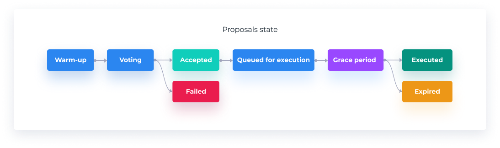

# Proposals & Voting

## Proposals

Anyone who holds enough vBOND can create a proposal. A proposal creator can only have one active proposal at a time but can vote on other proposals.


* To create a proposal you will need to have 1% of the BOND staked in Barn.
* The minimum quorum is 40% of staked BOND.
* The minimum acceptance vote is 60%.


Proposal is formed of:

* ID
* Title
* Description
* List of targets \(addresses\)
* List of values
* List of signatures
* List of calldata

Proposal has a maximum number of 10 actions that can be executed. When the proposal is executed, either all actions are executed or none of them. If one action reverts, the whole proposal execution reverts.


In order to give DAO participants enough time to stake, vote, check and discuss proposals, each of these periods lasts for 4 days: Warm-up, Voting, Queued for execution, Grace.

Notice, the Queue period is the only state that requires a user action to activate. So when it is activated, its 4 day lasting period counts from the moment when the voting ended, not when the user did the action. For example, if voting ends and someone queues the proposal 2 days after, it will not stay in the queue for 4 more days but only 2 days because 2 have already passed.


After being created, the proposal enters the **Warm-up** state to allow people to stake their BOND.

After **Warm-up**, any user can vote. The voting period starts immediately. At the first incoming vote if the creator’s balance falls below the 1% threshold the proposal is canceled automatically or it can be canceled by calling a function.

Once a proposal is accepted, it will have to wait in a queue before it can be executed. During this time, it can be canceled by:

* the creator;
* anyone if the creator’s balance falls below the 1% threshold;
* cancellation proposal.

Once a proposal becomes executable, any users can call the execute function. If the proposal is not executed during the **Grace** period, it is marked as expired and cannot be executed anymore.

Each proposal should include some documentation, etc.

## Abrogation Proposals

Abrogation proposal is a special type of proposal with 50% of staked BOND acceptance criteria. It can be created only during the **Queue** period.

A regular proposal can only have one associated abrogation proposal at any given time.

Anyone can vote on the abrogation proposals. Allowed voting actions are:

* vote for or against;
* cancel vote;
* change vote.

When the abrogation proposal starts, a new snapshot for voter balances is taken. Abrogation proposal’s duration is never greater than the initial proposal’s **Queue** period. Abrogation proposal’s end time is the same as the initial proposal’s end time.

When someone goes to execute the initial proposal — there is a check if an abrogation proposal that met its acceptance criteria exists.

## Voting

* You can vote using your vBOND balance + delegated vBOND at the voting start timestamp/block.
* The votes can only be pro or against.
* You can cancel and change your vote at any time.

