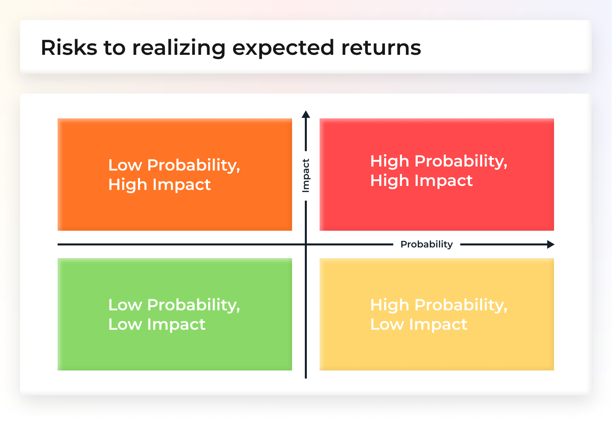
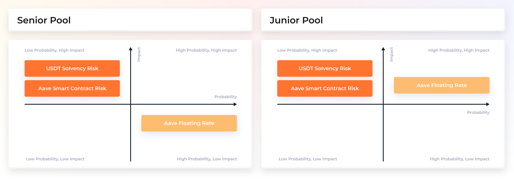
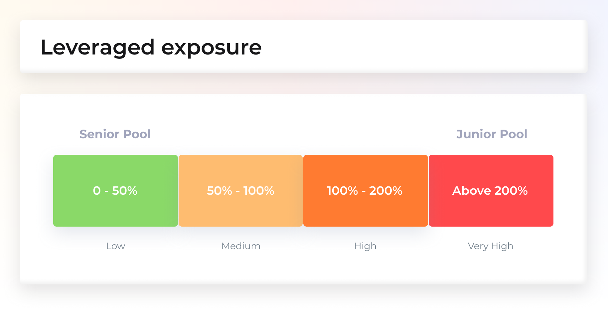
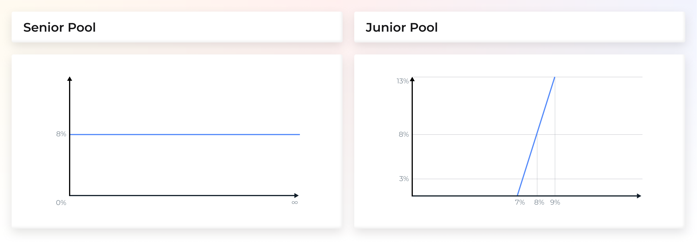

# Standards & Disclosures

## Product Risk Disclosures

We have defined two broad categories of risk disclosures:

* Quantitative risks, and
* Qualitative risks

## Quantitative Risks

### **1. Risks to realizing expected returns. Factors: Probability of Occurrence vs. Impact of Occurrence**

We would like to introduce a very simple but at the same time very powerful representation of risk factors for specific investment/pools/risk tranches. We place risk factors in the probability vs. impact map in four categories:

1. Low probability, Low impact
2. Low probability, High impact
3. High probability, Low impact
4. High probability, High impact

It is a simple way to view risks and their impact on P\&L, while having a way to estimate the probability of an event occurring. These risks would be self-reported by our team or others that may adopt this model. Investors will still need to do their own due diligence.

Let’s consider an example using a tranched AAVE interest rate pool with a Senior tranche and a Junior tranche, that is denominated in USDT. The senior pool has a fixed 8% return and the junior pool gets the remaining yield with 5x leverage.

The Author may want to describe and define at least three risk factors:

* The AAVE smart contract risk
* The USDT solvency risk
* The AAVE floating rate risk

### **2. Leverage exposure**

Leverage ratio of an asset pool relative to the underlying collateral

* Low: 0–50%
* Medium: 50% — 100%
* High: 100% — 200%
* Very High: Above 200%

### **3. Stress Tests**

Where applicable we will share stress test¹ information on potential extreme loss events², the probability of such events occurring, and the expected financial impact of various hypothetical scenarios that lead to losses of:

* 25%,
* 50%, and
* 100% of funds

When applicable we provide simple payout charts (Scenario vs P\&L), in this case we would analyze the effective Aave rate (resulting from the floating AAVE rate during the period) at the end of the period versus the P\&L for the corresponding pools

## Qualitative Risks

* Main risks — General summary of risks
* Exposure factors — Define the factors assets generally expose investors to
* Outlier Events — Potential outlier events that could induce extreme losses

## Protocol Technical Standards — ERC-20/ERC-721 

Our platform employs both ERC-20 and ERC-721 standards. These standards are the most widely used across the Ethereum ecosystem. They form the foundations of interoperability and composability across the decentralized finance ecosystem.

Our Junior Tokens are ERC-20 compatible since they are fungible. Secondary markets can offer and trade our tokens on decentralized platforms and other proprietary forums without permission.

The Senior BOND tokens are ERC-721, non-fungible (NFTs), but transferrable. One could sell these tokens before their maturity date at a discount to someone who is willing to wait until the end to claim the principal plus the guaranteed reward.

BarnBridge may build or support a third-party to build a marketplace for trading Senior BOND Tokens. The pool is permissionless so any entity can build marketplaces or incorporate our tokens into an already existing venue.

## Term Definitions and Nomenclature 

One of the most common forms of credit enhancement in CDOs is subordination of junior tranches. In the multi-tranche or senior/subordinated CDO, the subordinated or junior tranches support the senior tranches. The issuance proceeds from debt and equity are used to purchase collateral (assets) generally with a principal balance equal to the rated debt amounts (liabilities) plus the equity share. Since the equity is not typically rated, the asset pool supporting the rated liabilities is greater than the rated liability amounts. Thus, there is a loss amount that the assets can sustain without immediately affecting any of the rated liabilities.

The payment priority waterfall in the transaction prioritizes the payments to each class of debt holders. CDO payments are typically paid sequentially with the seniors made whole first followed by the more subordinated tranches. Thus, holders of the senior debt tranche have priority of payment over the holders of any junior debt tranche. As a result of their subordinate status, the junior debt tranches generally are rated lower than the senior debt. However, the junior debt holders are compensated for the additional risk by being paid a higher interest rate.

Below is a list of product attributes, terms, and definitions we will use going forward:

## **References**

1. [BarnBridge Source Research](https://www.notion.so/barnbridge/CDO-Standards-Research-db29f2b80ec84fc9a694acacf1665459)
2. [User perspective on Financial Instrument Risk disclosures Under International Financial Reporting Standards](https://www.cfainstitute.org/-/media/documents/article/position-paper/perspective-on-financial-instrument-risk-disclosures-under-ifrs-vol-1.ashx)
3. [SEC Market Risk Disclosure Rules](https://www.sec.gov/divisions/corpfin/guidance/derivfaq.htm)
