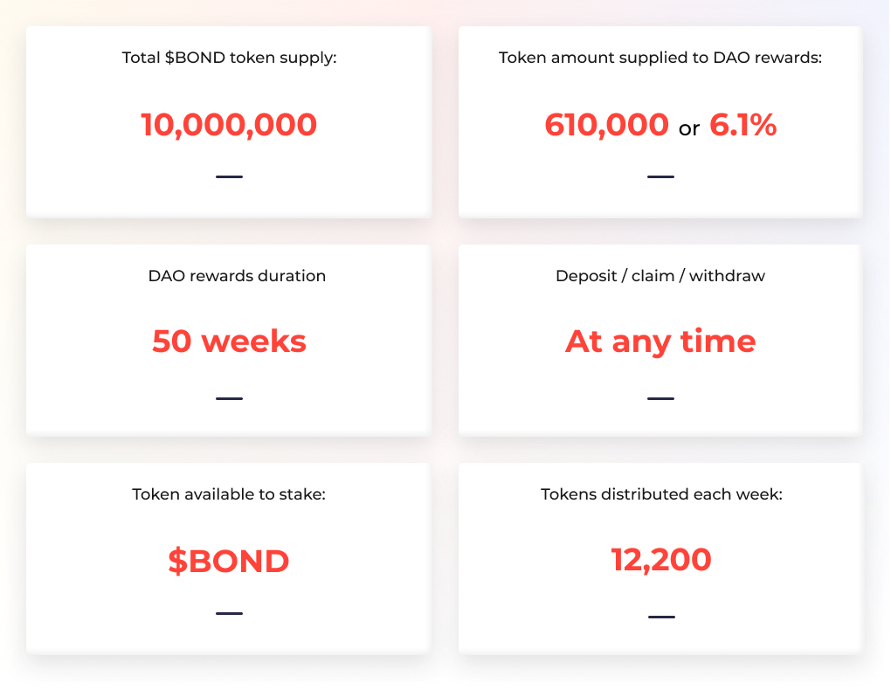

# Active Pools

## bb\_cUSDC Rewards Pool

bb\_cUSDC Rewards Pool is incentivizing junior token holders with BOND rewards for staking. 10,000 BOND tokens are distributed each week. 

Start staking in the pool: [Launch app](https://app.barnbridge.com/smart-yield/pool?m=compound/v2&t=USDC).

## DAO Staking Pool

DAO Staking pool was launched on Feb 8th, 2021. It was designed as an extra incentive for the early DAO participants. In addition to voting power, you also receive rewards from the DAO rewards pool.

The pool is preloaded with 610,000 $BOND tokens and should run for 50 weeks. Find more details about DAO staking here: [Pool 3 ends and DAO governance rewards begins](https://medium.com/barnbridge/pool-3-ends-and-dao-governance-rewards-begins-8e57ec5041).

## USDC/BOND LP Pool 

USDC/BOND liquidity pool incentivization program was launched on Oct 26th, 2020. The concept behind the initiative is to reward long-term liquidity providers of the Uniswap USDC/BOND pool with progressively more power over the protocol as they continue to signal their belief in the BarnBridge vision.  
  
You have to stake the uniswap v2 LP tokens \(USDC\_BOND\_UNI\_LP\). You’ll get them for providing liquidity to the [USDC/BOND pool](https://app.uniswap.org/#/add/v2/0x0391d2021f89dc339f60fff84546ea23e337750f/0xa0b86991c6218b36c1d19d4a2e9eb0ce3606eb48) on Uniswap.

Read more about USDC/BOND pool on Medium: [Yield Farming and LP Incentivization](https://medium.com/barnbridge/yield-farming-and-lp-incentivization-25eba3f55ec4) and [Yield Farming $BOND: The Risks Involved](https://medium.com/barnbridge/yield-farming-bond-the-risks-involved-7cefdba01b17).

