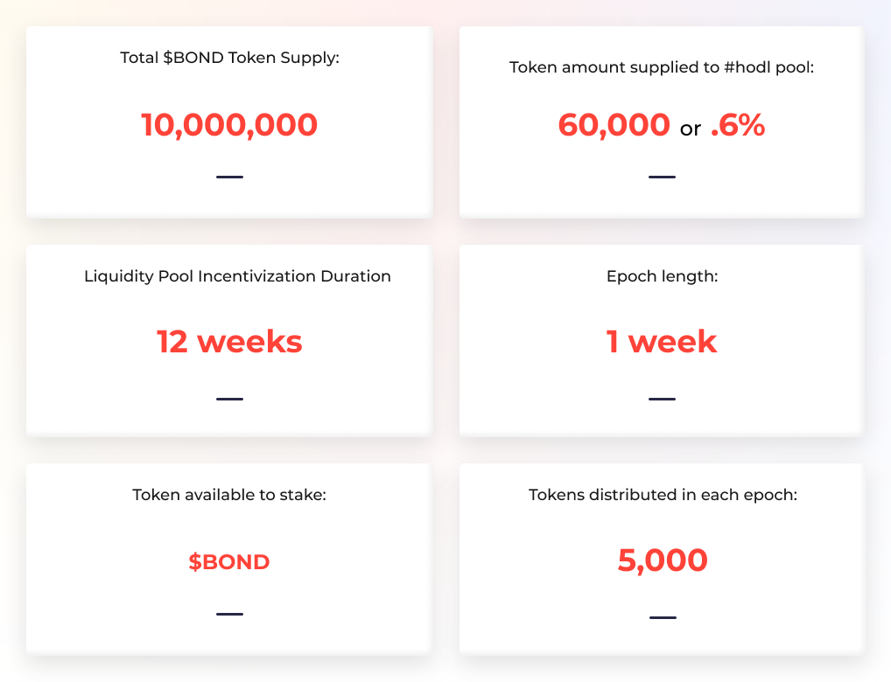

# Inactive Pools \(Ended\)

## USDC/DAI/sUSD Pool

USDC/DAI/sUSD yield farming pool was launched on Oct 19th, 2020. This staking contract was the first mechanism delivering initial $BOND token distribution to the community. This contract held 8% of the total supply and was distributed to community members who staked DAI, USDC, & sUSD.

Stablecoins were equally rewarded. 1 USDC = 1 DAI = 1 sUSD.

Read more about the pool in this Medium post: [Yield Farming and LP Incentivization](https://medium.com/barnbridge/yield-farming-and-lp-incentivization-25eba3f55ec4).

## BOND Staking Pool

BOND Hodl Pool was launched on Nov 16th, 2020. It has been running for 12 epochs \(weeks\) and distributing 60,000 $BOND tokens in rewards to the users.

BOND Hodl Pool ended on Feb 8th, 2021. If you haven’t claimed your rewards or withdrawn your deposit yet - don’t panic. You can do that at any time.

